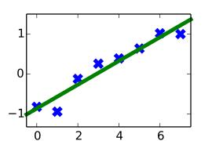

# Naked Tensor

This is a bare bones example of *TensorFlow*, a machine learning package published by Google. You will not find a simpler introduction to it.

In each example, a straight line is fit to some data. Values for the slope and y-intercept of the line that best fit the data are determined using gradient descent. If you do not know about gradient descent, check out the [Wikipedia page](https://en.wikipedia.org/wiki/Gradient_descent).

After creating the required variables, the error between the data and the line is *defined*. The definition of the error is plugged into the optimizer. TensorFlow is then started and the optimizer is repeatedly called. This iteratively fits the line to the data by minimizing the error.

Read the scripts in this order:
 * serial.py
 * tensor.py
 * bigdata.py

## Serial.py

The purpose of this script is to illustrate the nuts and bolts of a TensorFlow model. The script makes it easy to understand how the model is put together. The error between the data and the line is defined using a for loop. Because of the way the error is defined, the calculation runs in serial.

## Tensor.py

This script goes a step farther than `serial.py` although it actually requires fewer lines of code. The outline of the code is the same as before except this time the error is defined using tensor operations. Because tensors are used, the code can run in parallel.

You see, each point of data is treated as being independent and identically sampled. Because each point of data is assumed to be independent, the calculations are too. When you use tensors, each point of data is run on separate computing cores. There are 8 points of data, so if you have a computer with eight cores it should run almost eight times faster. 

## BigData.py

You are one buzzword away from being a professional. Instead of fitting a line to just eight datapoints, we will now fit a line to 8-million datapoints. Welcome to **big data**.

There are two major changes in the code. The first is bookkeeping. Because of all the data, the error must be defined using placeholders instead of actual data. Later in the code, the data is fed through the placeholders. The second change is that because we have so much data, only a sample of data is fed into the model at any given time. Each time an operation of gradient descent is called, a new sample of data is fed into the model. By sampling the dataset, *TensorFlow* never has to deal with the entire dataset at once. This works surprisingly well and there is [theory](https://en.wikipedia.org/wiki/Stochastic_gradient_descent) that says it is okay to do this. There are a few conditions that the theory says are important, like the step size must decrease with each iteration. For now, who cares! It works.

## Conclusion

As you worked through the scripts, you hopefully saw how the error can be anything you wanted it to be. It could be the error between a set of images and a convolutional neural network. It could be the error between classical music and a recurrent neural network. Let your imagination run wild. Once the error is defined, you can use *TensorFlow* to try and minimize it.

That's it. Hopefully you found this tutorial enlightening.

## Requirements

 * [Python3](https://www.python.org/)
 * [TensorFlow](https://www.tensorflow.org/)
 * [NumPy](http://www.numpy.org/)
